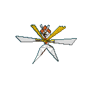
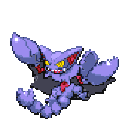

<h1 align="center">👋 Hello! I'm AndyFerns</h1>

  <strong>Budding Computer Engineering student passionate about everything related to software!</strong>

  
  
  

🎓 **Computer Engineering student** passionate about building software and problem solving.

💻 Experienced with **Python**, including frameworks like **Flask** and **Django**.

🤖 Currently exploring **Systems Programming** and **Natural Language Processing**, while strengthening my foundations in **C, Java, and JavaScript**.

---
## 💻 Tech Stack

<b>Programming Languages</b>

 

 
 
 
 
 
 
 
 

<b>Web Development</b>

 

**Frontend**

 
 
 
 

**Backend / APIs**

 
 
 
 
 
 
 
 

<b>AI / Machine Learning / Data Science</b>

 

 
 
 
 
 
 
 
 
 
 
 

<b>Databases</b>

 

 
 
 
 
 

<b>DevOps / Infrastructure</b>

 

 
 
 
 

<b>Development Tools</b>

 

 
 
 
 
 
 

<b>Systems / Scripting</b>

 

 

<b>Mobile / Application Development</b>

 

 

  

<b>Game / Graphics / Creative</b>

 

 
 

<b>Blockchain / Web3</b>

 

 

<b>Documentation / Markup</b>

 

 

---

## 📊 GitHub Stats

  

  
  

## 🛠️ Impactful Projects

<!--START_PROJECTS-->
| Project | Description | Languages |
|---------|-------------|-----------|
| [GBCee](https://github.com/AndyFerns/GBCee) | A Gameboy emulator built entirely in C and the SDL2 library |        |
| [Automated-Reasoning-Project](https://github.com/AndyFerns/Automated-Reasoning-Project) | A project aiming to implement Automated Reasoning in First Order Logic using NLP |      |
| [MemoBase](https://github.com/AndyFerns/MemoBase) | Offline-first codebase memory system that provides intelligent code analysis, search, and visualization capabilities |   |
| [vscode-dir-builder](https://github.com/AndyFerns/vscode-dir-builder) | Leverage directory trees provided by LLMs and convert them into actual files and folders in memory |    |
| [Accessible-Math-Reader](https://github.com/AndyFerns/Accessible-Math-Reader) | A screen-reader-first mathematical accessibility toolkit for converting LaTeX, MathML, and plaintext/Unicode math into speech, Braille, and navigable ARIA structures. |       |
| [Determa](https://github.com/AndyFerns/Determa) | Programming Language built from scratch, imitating C with type-safety, a garbage collector and a self-made compiler |     |
| [Hibiscus](https://github.com/AndyFerns/Hibiscus) | A modern workspace editor for study and productivity |       |
<!--END_PROJECTS-->

## 🚀 Current Endeavors

- Working on projects related to software development.
- Learning Rust to enhance my systems programming skills.
- Looking to collaborate on exciting projects and open-source contributions.

## 📫 Let's Connect

Feel free to reach out to me:

- 📧 Email: [write2andrew.important@gmail.com](mailto:write2andrew.important@gmail.com)

I'm always open to discussing new ideas and collaborations!

---

*Thank you for visiting my profile!*

<!---
AndyFerns/AndyFerns is a ✨ special ✨ repository because its `README.md` (this file) appears on your GitHub profile.
You can click the Preview link to take a look at your changes.
--->
