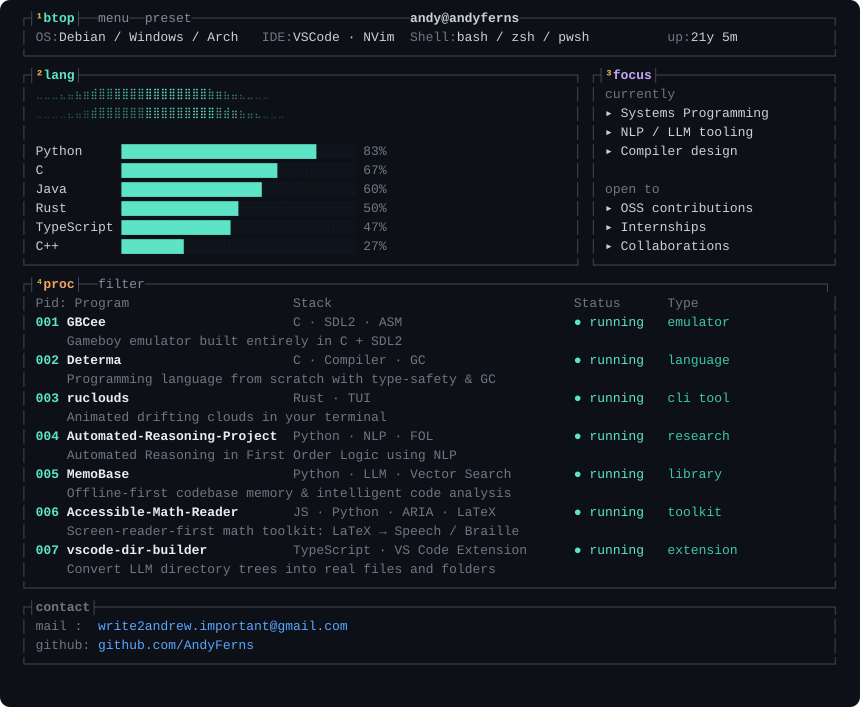

<h2 align="center">

hey! I'm andyferns

</h2>

<p align="center">
  <strong>Computer Engineering student passionate about everything related to software!</strong>
</p>

<!-- <p align="center">
  
</p> -->

<p align="center">
  
</p>

<p align="center">
  
</p>

<!-- 
<p align="center">
  
  
</p> -->

<p align="center">
  
</p>

## Let's Connect

```bash
$ contact --email
write2andrew.important@gmail.com
```

```bash
$ collaborate --status
✓ accepting ideas
✓ open to collaborations
✓ always learning
```

*Thank you for visiting my profile!*
